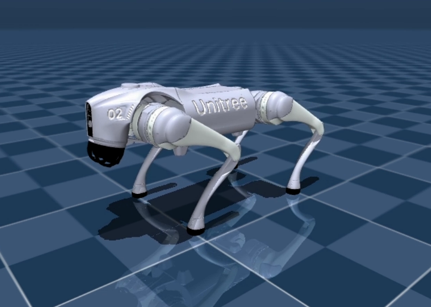

Pasos:

1. Entrenar en Colab (GPU T4) las celdas del archivo unitree_go2_ppo_colab_v4.1.ipynb
2. Descargar desde la celda 6 los archivos:
	go2_vecnormalize_steps.pkl (antes de "_steps" el algoritmo le cambiara el nombre al archivo)
	go2_ppo_steps.zip (antes de "_steps" el algoritmo le cambiara el nombre al archivo)
	Ejemplo:
	go2_vecnormalize_1000000_steps.pkl
	go2_vecnormalize_1000000_steps.pkl
3. Ejecutar en PC local el archivo evaluate.py (usando un venv o entorno virtual desde vscode, pycharm, etc.)
4. El video renderizado quedara grabado en pocos segundos en la PC local.

   

